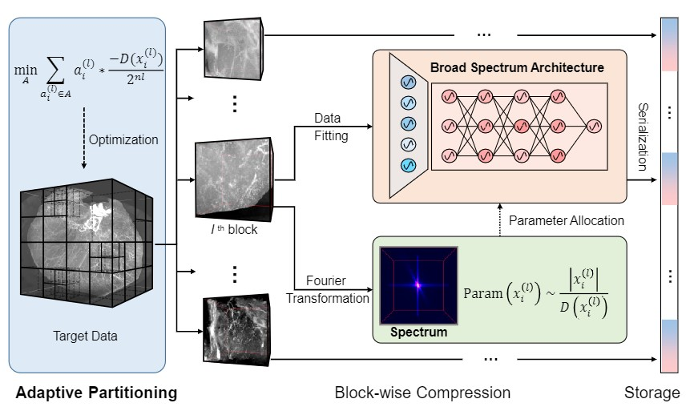
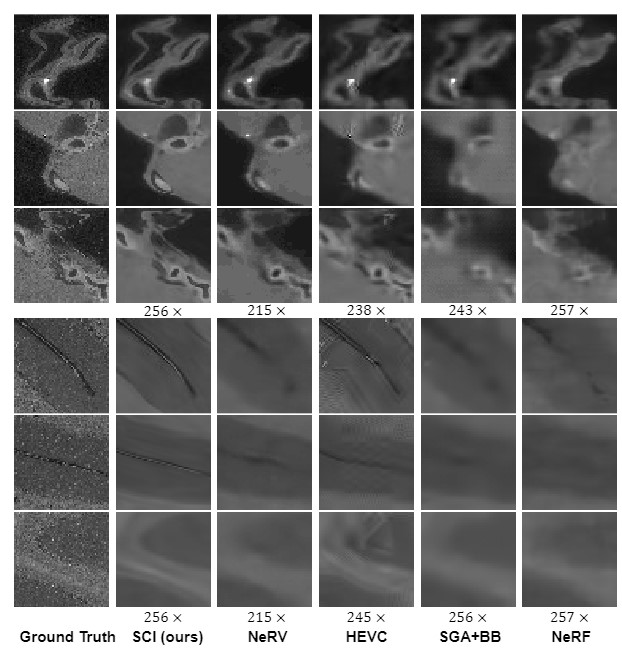

# 💾Implicit Neural Compression (INC)
Welcome to INC! This repository is aimed at helping researchers or developers interested in
INC data compression algorithms to quickly understand and reproduce our latest research.

# 🚀Quickstart

### 0. Clone repository

	git clone git@github.com:RichealYoung/ImplicitNeuralCompression.git
	cd ImplicitNeuralCompression
### 1. Create a conda environment

    conda create -n inc python=3.10
    conda activate inc

### 2. Install python libraries
	pip3 install -r requirements.txt
<!-- ### 3. Register Gurobi and get license

[Register and install an academic license](https://www.gurobi.com/downloads/free-academic-license/) 
for the Gurobi optimizer (this is free for academic use). -->

### 3. Compression

	python sci.py -c config/SingleExp/sci.yaml -g 2

All hyper-parameters can be set in the YAML file.

❗Note: The partition methods will be released soon!

# 🧰Batch Experiments
We have also provided a useful script 'BatchExp.py' for researchers to perform batch experiments quickly. You just need to configure this group of experiments in the YAML file, pick the GPUs, and start batch experiments with the following command.

	python BatchExp.py -c config/BatchExp/sci.yaml -stp sci.py -g 0,1,2,3

These experiments will automatically wait or execute depending on GPU utilization. All you have to do is a cup of coffee and watching the World Cup⚽.
# 😘Citations

	@misc{https://doi.org/10.48550/arxiv.2209.15180,
	doi = {10.48550/ARXIV.2209.15180},
	
	url = {https://arxiv.org/abs/2209.15180},
	
	author = {Yang, Runzhao and Xiao, Tingxiong and Cheng, Yuxiao and Cao, Qianni and Qu, Jinyuan and Suo, Jinli and Dai, Qionghai},
	
	title = {SCI: A Spectrum Concentrated Implicit Neural Compression for Biomedical Data},
	
	publisher = {arXiv},
	
	year = {2022},
	
	copyright = {arXiv.org perpetual, non-exclusive license}
	}

# 💡Contact
If you need any help or are looking for cooperation feel free to contact us.
yangrz20@mails.tsinghua.edu.cn